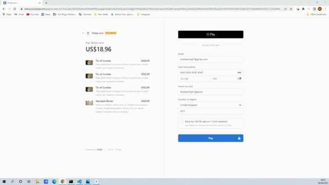

# redux-store

This is an e-commerce web app built with Redux.
Live demo [_here_](https://redux-store-mdaaboul.herokuapp.com/).

## Table of Contents

- [General Info](#general-information)
- [Installation](#installation)
- [Usage](#usage)
- [Appearance](#appearance)
- [Technologies Used](#technologies-used)
- [Setup](#setup)
- [Project Status](#project-status)
- [Contact](#contact)
- [License](#license)

## General Information

The purpose of this task was to take a fully functioning e-commerce store built using React's Context API, and refactor it to be fully built with Redux. This app is built using the MERN stack and a GraphQL server. It is set up to allow users to have the following features:

- Update products in Cart
- Add products to Cart
- Update Cart quantity
- Remove items from Cart
- Add multiple items to Cart to the back end.
- Update categories
- Update current category
- Clear Cart
- Toggle Cart

This task involved the following:

- Rebuilt the app using Redux.
- Ensured all tests pass upon migration to Redux.

## Installation

​Install dependencies using:

    npm install

## Usage

Need to have MongoDB and MongoDB Compass installed locally to run the app. Alternatively, you can also refer to the live app.

The application will then be invoked by using the following command:

    npm run develop

## Appearance

Below depicts functionality of the main app main features:

Below also depicts functionality of the app at checkout:

Below depicts how to run the app tests using Jest:

## Technologies Used

- Redux
- GraphQL
- MongoDB
- Express.js
- React
- Node.js

## Setup

- Text editor (VS Code recommended)
- An Internet browser (Google Chrome recommended)
- MongoDB and MongoDB to be locally installed
- MongoDB Atlas for live deployment
- Heroku

## Project Status

Project is: complete.

## Contact

Created by -[@moedaaboul](https://github.com/moedaaboul)

- Feel free to contact me!

## LICENSE

This work is licensed under
[MIT](https://github.com/moedaaboul/moedaaboul.github.io/blob/main/LICENSE).
